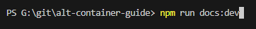
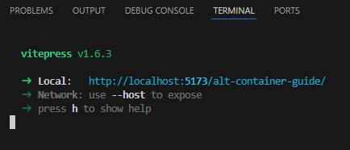
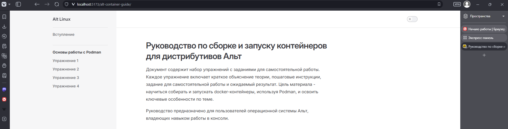
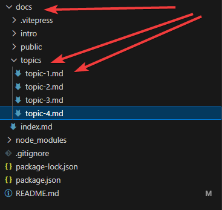

# alt-container-guide

Руководство по сборке и запуску контейнеров для дистрибутивов Альт

## Ссылки на оригинал проекта реализованного с помощью jekyll 
[Ссылка на проект github (оригинал)](https://github.com/alt-container-guide/alt-container-guide.github.io)

[Вебсайт (оригинал)](https://alt-container-guide.github.io)

> node: v22.14.0

**Запуск**

```bash
npm run docs:dev
```


если все сработало, то должно появиться следующее



Копируем ссылку которая появилась ```http://localhost:5173/alt-container-guide/``` в браузер. 

В результате видим главную страницу




**Редактирование Упражнений**

Открываем директорию ```docs```, в ней находим диекторию ```topics```, в данной директории находятся все упражнения.
* topic-1.md
* topic-2.md
* topic-3.md
* ...

